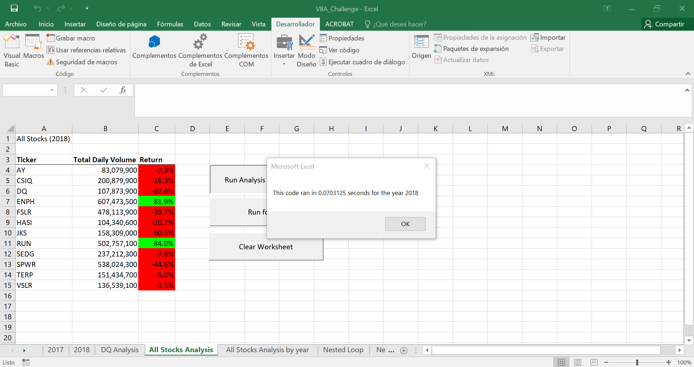

# Refactoring Code

## Overview of Project

### Purpose

The main objective of this challenge is to optimize code previously worked through module II using an Index rather than making the program going over and over every single stock data by refactoring code method.

## Results

As the main result of this exercise by re-doing the original script and working in a more efficient way, the most immediate result that can be appreciated it's the fastest way that runs and event adding the format and fonts. I realize that the previous version took over 0.4 seconds and the new one in less than 0.07 seconds in both years.

Exhibit A previous script 2017:

Exhibit B refactored-code 2017:

Exhibit C previous script 2018:

Exhibit D refactored-code 2018:

Regarding the code the main difference from the original script is the Index created to run through the program, making it faster than the previous version. The only limitation that I found in the code is that it only works if the stock data is ordered by stock.

## Summary

By advantages found in the refactored code, I would point out that it runs fast and it is an optimized version from the previous, by disadvantages I found that it only works if stocks are ordered by each stock, but if data were in a random way the previous code could work with some changes.
